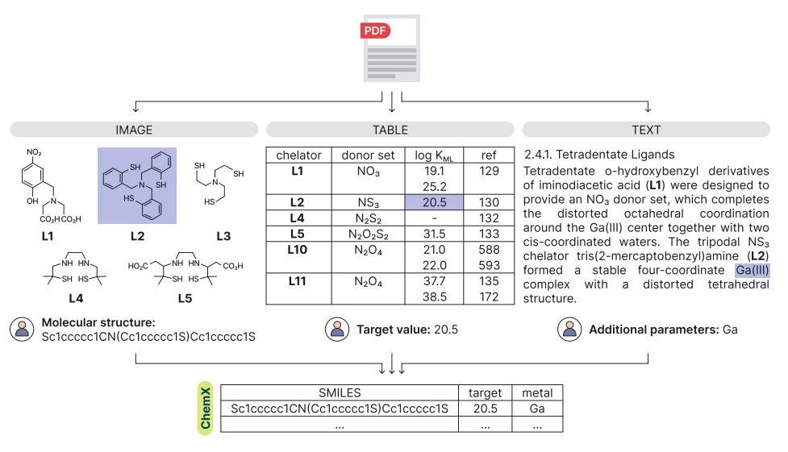

# DataCon'26 — Финальная задача

## 🧪 О проекте

Финальная задача DataCon'26 посвящена **автоматической экстракции химических данных из научной литературы**.

Химия — одна из наиболее насыщенных данными наук, однако большая часть экспериментальных результатов по-прежнему хранится в виде неструктурированного текста в PDF-статьях. Автоматическое извлечение структурированной информации из таких источников открывает путь к созданию баз данных химических соединений и разработке предсказательных моделей.

В основе задачи лежит бенчмарк **[ChemX](https://github.com/ai-chem/ChemX)** — первый систематический бенчмарк для оценки систем извлечения информации из химических публикаций, созданный Центром ИИ в химии и опубликованный на NeurIPS 2025. Бенчмарк охватывает **10 датасетов** по двум направлениям: малые молекулы и наноматериалы. Каждый датасет содержит тексты научных статей и соответствующие им структурированные аннотации с химическими свойствами соединений.



Участники должны разработать собственную систему экстракции, которая **превзойдёт базовый подход single-agent**, опубликованный в статье ChemX (NeurIPS 2025), и продемонстрировать её работу через веб-интерфейс.

---

## ⚙️ Пайплайн

```
  Научная статья (PDF)
          │
          ▼
  ┌───────────────────┐
  │   Предобработка   │  парсинг PDF, извлечение текста / изображений
  └────────┬──────────┘
           │
           ▼
  ┌───────────────────┐
  │    Экстракция     │  LLM, fine-tuning, multi-agent, RAG,
  │                   │  классические NLP-методы или их комбинация
  └────────┬──────────┘
           │
           ▼
  ┌───────────────────┐
  │  Оценка качества  │  Precision, Recall, Macro-F1 по полям домена;
  │  и сравнение с    │  сопоставление с метриками single-agent
  │  ChemX            │  бейзлайна из статьи ChemX
  └────────┬──────────┘
           │
           ▼
  ┌───────────────────┐
  │  Веб-интерфейс    │  загрузка статьи → просмотр извлечённых данных
  └───────────────────┘
```

Выбор технологий на каждом этапе полностью свободен.

---

## 📋 Описание задачи

### Датасеты ChemX

Бенчмарк содержит 10 датасетов, разделённых на два направления.

Каждый датасет — это таблица, где **одна строка соответствует одному извлечённому химическому объекту** (соединению, наноматериалу или экспериментальному измерению) из конкретной научной статьи. Столбцы делятся на два типа:
- **Химические поля** — целевые значения, которые нужно извлечь: структура молекулы (SMILES), измеренные свойства (концентрации, размеры, активности и т. д.), условия эксперимента.
- **Поля источника** — откуда взяты данные: DOI статьи, номер страницы, раздел, тип источника (текст / таблица / рисунок).

Задача системы экстракции — по тексту статьи воспроизвести химические поля для каждого объекта. Поля источника в оценке не участвуют. **Размер** в таблицах ниже — количество строк (извлечённых объектов) в датасете.

**Малые молекулы**

| Датасет | Описание | Размер |
|---|---|---|
| [EyeDrops](https://huggingface.co/datasets/ai-chem/EyeDrops) | Проницаемость роговицы и липофильность препаратов для глазных капель | 163 |
| [Benzimidazoles](https://huggingface.co/datasets/ai-chem/Benzimidazoles) | Антибактериальная активность (MIC) производных бензимидазола | 1 720 |
| [Oxazolidinones](https://huggingface.co/datasets/ai-chem/Oxazolidinones) | Антибактериальная активность (pMIC) производных оксазолидинона | 2 920 |
| [Co-crystals](https://huggingface.co/datasets/ai-chem/Co-crystals) | Свойства фармацевтических сокристаллов (растворимость, фотостабильность) | 70 |
| [Complexes](https://huggingface.co/datasets/ai-chem/Complexes) | Металло-лигандные комплексы для радиофармацевтики | 907 |

**Наноматериалы**

| Датасет | Описание | Размер |
|---|---|---|
| [Nanozymes](https://huggingface.co/datasets/ai-chem/Nanozymes) | Наночастицы с ферментоподобной активностью (кинетика, условия реакции) | 1 140 |
| [Synergy](https://huggingface.co/datasets/ai-chem/Synergy) | Синергетический антимикробный эффект наночастиц и антибиотиков | 3 230 |
| [Nanomag](https://huggingface.co/datasets/ai-chem/Nanomag) | Магнитные и биомедицинские свойства магнитных наночастиц | 2 580 |
| [Cytotox](https://huggingface.co/datasets/ai-chem/Cytotox) | Цитотоксичность наночастиц (жизнеспособность клеток) | 5 480 |
| [SelTox](https://huggingface.co/datasets/ai-chem/SelTox) | Антимикробная активность и токсичность наночастиц серебра | 3 240 |

### Бейзлайн

В статье ChemX для каждого домена опубликованы метрики подхода **single-agent**. Его архитектура:

1. **Предобработка PDF** — библиотека [`marker-pdf`](https://github.com/VikParuchuri/marker) конвертирует статью в Markdown, сохраняя структуру документа: текст и таблицы переводятся в Markdown, для изображений генерируются локальные пути, которые вставляются на соответствующие позиции в документе.
2. **Описание изображений** — каждое извлечённое изображение обрабатывается моделью `gpt-4o-2024-11-20` с помощью специального промпта для описания. Результат вставляется в Markdown внутри тегов `<DESCRIPTION_FROM_IMAGE>`, формируя файл `described.md`.
3. **Извлечение информации** — итоговый `described.md` передаётся модели `gpt-4.1-mini-2025-04-14`, которая извлекает структурированные данные в формате датасета ChemX и сохраняет результат в CSV-файл.

**Цель — превзойти метрики single-agent хотя бы на одном домене.** За каждый дополнительный домен начисляются бонусные баллы.

| Домен | Направление | Macro-F1 (single-agent) |
|---|---|:---:|
| Benzimidazoles | Малые молекулы | 0.217 |
| Oxazolidinones | Малые молекулы | 0.491 |
| Co-crystals | Малые молекулы | 0.296 |
| Complexes | Малые молекулы | 0.290 |
| Nanozymes | Наноматериалы | 0.164 |
| Synergy | Наноматериалы | 0.080 |
| Nanomag | Наноматериалы | 0.034 |
| Cytotox | Наноматериалы | 0.182 |
| SelTox | Наноматериалы | 0.045 |

Подробные метрики (Precision, Recall, F1 по каждому полю) для каждого домена и каждой экстрагированной величины доступны в папке [`metrics/`](./metrics).


### Метрика оценки

Качество экстракции оценивается по схеме ChemX:

- **Precision, Recall, F1** для каждого поля записи
- **Macro-F1** — усреднённый F1 по всем полям домена (основная метрика сравнения с бейзлайном)

### Требования к решению

1. **Система экстракции** — любые технологии и подходы.
2. **Веб-интерфейс** — приложение, позволяющее загрузить PDF-статью и получить извлечённые данные в табличном виде.
3. **Репозиторий** — воспроизводимый код, инструкция по запуску (`README`), зафиксированные зависимости.
4. **Финальные метрики** — значения Macro-F1 на тестовых данных ChemX с указанием домена(ов).

> ⚠️ **Важно:** значительная часть данных в статьях содержится не в тексте, а в таблицах, графиках и рисунках. Корректная обработка изображений — один из ключевых факторов качества экстракции.

---

## 🏆 Критерии оценивания

| Критерий | Баллы | Описание |
|---|:---:|---|
| Качество экстракции | 40 | Macro-F1 на тестовых данных ChemX относительно single-agent бейзлайна |
| Веб-интерфейс | 20 | Наличие, корректность работы, удобство отображения результатов |
| Качество кода | 20 | Структура репозитория, читаемость, воспроизводимость запуска |
| README репозитория | 20 | Описание подхода и обоснование выбранных решений, анализ ошибок, финальные метрики, инструкция по установке и запуску |
| **Итого** | **100** | |

### Дополнительные баллы

За выход за рамки минимальных требований начисляются бонусные баллы:

| Бонус | Баллы |
|---|:---:|
| Каждый дополнительный домен сверх одного (макс. 8) | +5 за домен |
| Решение, работающее на обоих направлениях (малые молекулы + наноматериалы) | +10 |

---

## 🔗 Полезная информация

### Ресурсы

| Ресурс | Ссылка |
|---|---|
| Датасеты ChemX (Hugging Face) | https://huggingface.co/collections/ai-chem/chemx |
| Код бенчмарка и бейзлайнов (GitHub) | https://github.com/ai-chem/ChemX |
| Статья ChemX (NeurIPS 2025) | https://proceedings.neurips.cc/paper_files/paper/2025/file/9e08a1db869a9646418e3371b24c6ae6-Paper-Datasets_and_Benchmarks_Track.pdf |

### Советы

- Начните с **одного домена** — воспроизведите метрику бейзлайна, затем улучшайте.
- Изучите схему каждого датасета на Hugging Face: поля, типы данных, примеры значений — это определяет, что именно нужно извлекать.
- Веб-интерфейс можно реализовать минимальными средствами (Streamlit, Gradio), главное — корректная работа.
- Код экспериментов бейзлайна в репозитории ChemX (`LLM/`) — полезная отправная точка для понимания входного формата и схемы оценки.
